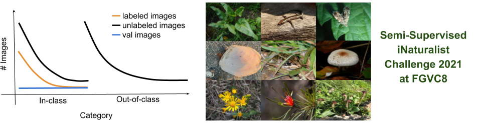

## Semi-Supervised iNaturalist Challenge at FGVC8
This semi-supervised recognition challenge focuses on recognizing
animal, plant, and fungi species from partially labelled data.
This dataset is designed to expose some of the challenges encountered
in a realistic application, such as the highly similar classes, class
imbalance, and domain mismatch between the labeled and unlabeled data.
Different from last year's challenge, this challenge includes more
species that span different kingdoms, and does not make a distinction
between in-class and out-of-class unlabeled data.


This challenge is part of the
[FGVC8 workshop](https://sites.google.com/view/fgvc8) at
[CVPR 2021](http://cvpr2021.thecvf.com/).
Teams with top submissions, at the discretion of the workshop
organizers, will be invited to present their work at the workshop.

The competition will be hosted on [Kaggle](https://www.kaggle.com/c/semi-inat-2021).

Please open an issue here (or email `jcsu@cs.umass.edu`) if you have questions or problems
with the dataset.

### Updates
* 3/8/2021: Dataset released, challenge starts.
* 3/30/2021: **The annotation has been updated, please use the updated version ([annotation_v2.json](http://vis-www.cs.umass.edu/semi-inat-2021/annotation_v2.json)).**


### Important Dates
|Event|Date|
|:------:|:---------------:|
Data Released|March 8, 2021|
Submission Server Open |March 8, 2021|
Submission Deadline|May 31, 2021|
Winners Announced|June 7, 2021|

### Content
- [Dataset Intro](#the-semi-supervised-inaturalist-dataset)
- [Guidelines](#challenge-guidelines)
- [Data and Annotations](#data-and-annotations)
- [Submission Format](#submission-format)
- [Baseline](#baseline-performace)
- [Terms of Use](#terms-of-use)
- [Acknowledgements](#acknowledgements)


## The Semi-Supervised iNaturalist Dataset

This challenge focused on semi-supervised fine-grained classification where we
provide labeled data of the target classes and unlabeled data from
both target and non-target classes.
The data is obtained from iNaturalist, a community
driven project aimed at collecting observations of biodiversity.
See information below about how this challenge relates to previous
iNaturalist challenges at FGVC and other existing datasets.

Our dataset comes with standard training, validation and test sets.
The training set consists of:

* **labeled images** from 810 species, where around 10% of the images are labeled.
* **unlabeled images** contains unlabeled images from the same set of classes
as the labeled images (**in-class**), plus the images from a different set of classes as the labeled set (**out-of-class**). The species are guaranteed to have species at the same phylum level in the labels set. This reflects a common scenario where a coarser taxonomic label of an image can be easily obtained. We also provide the kingdom and phylum annotations for each unlabeled image.
  
The validation and test set contain 5 and 20
images respectively for each of the 810 categories in the labeled set.
The distributions of these images are shown in the table below.

| Split | Details | #Classes	| #Images |
|:------:|:-------:|:--------:|:-------------:|
Train | Labeled | 810 | 9,721 |
Train | Unlabeled| - | 313,248|
Val  | Labeled | 810 | 4,050 |
Test | Public | 810 | 8,100 |
Test | Private| 810 | 8,100 |

The number of images per class follows a heavy-tailed distribution as
shown in the Figure above. The validation and test sets are uniformly distributed over the classes.


### Evaluation Criteria
The performance will be measured as the per-image accuracy (top-1) on
the test set. The images in the test set are guaranteed to be one of
the 810 categories in the training set.

### Differences from Semi-Supervised iNaturalist Challenges at FGVC7
This challenge differs from the previous [Semi-Supervised
iNaturalist-Aves Competition at
FGVC7 (Semi-Aves)](https://github.com/cvl-umass/semi-inat-2020) in the
following ways:
1. **Combined unlabeled data:** We combined unlabled data from
   **in-class** and **out-of-class**, and do not provide the label.
2. **New species:** Our dataset has no overlapping species
   between previous iNat competitions, including iNat-17, iNat-18,
   iNat-19, iNat-21, and Semi-Aves.
3. **Species from different kingdoms:** Unlike Semi-Aves where all the
   species are from the Aves (birds) kingdom, we have a diverse set of
   species including animal, plants, and fungi. The distribution is
   shown in the following table.

| Kingdom | #Classes |
|:------:|:-------:|
| Animalia | 429 |
| Plantae | 342 |
| Fungi | 39 |

### Differences from Existing Semi-Supervised Benchmarks
Unlike prior benchmarks on semi-supervised learning (other than Semi-Aves), our dataset
exposes the following challenges:
1. Long-tailed distribution of classes. 
2. The unlabeled data come from both target and non-target classes.
3. Fine-grained similarity between classes.


## Challenge Guidelines

Participants **are allowed** to use the labeled and unlabeled images in the
training and validation set in any way they like. Participants are
**not allowed** to use images, labels, or pre-trained
models from previous iNaturalist competitions 
(including iNat-17, iNat-18, iNat-19, iNat-21, and Semi-Aves) 
or any other datasets. 
However, participants **are allowed** to use ImageNet-1k (not 21k) pre-trained
model (e.g., pre-trained models from
[torchvision](https://pytorch.org/docs/stable/torchvision/models.html)).
If you cannot verify the training set of a model, we strongly urge you
to not use them because of the potential overlap of class labels.

The general rule is that participants should only use the provided
images and annotations (except for the ImageNet-1k
pre-trained models) to train a model. 
For example, dataset from previous iNaturalist competitions or other
existing datasets, collecting data from the web or iNaturalist
website, or additional annotation on the provided images is **not
permitted**.


## Data and Annotations

All the images are stored in JPEG format and have a maximum dimension
of **300px**. Note this is different from the previous year where the
images have a max dimension of 500px.

You can download the dataset files here or on [Kaggle](https://www.kaggle.com/c/semi-inat-2021): 
  * [Labeled training images [164MB]](http://vis-www.cs.umass.edu/semi-inat-2021/l_train.tar.gz)

  * [Labeled validation images [67MB]](http://vis-www.cs.umass.edu/semi-inat-2021/val.tar.gz)
      
  * [Unlabeled training images [5.2GB]](http://vis-www.cs.umass.edu/semi-inat-2021/u_train.tar.gz)
      
  * [Test images [271MB]](http://vis-www.cs.umass.edu/semi-inat-2021/test.tar.gz)
      
  * [Annotations (v2) [31MB]](http://vis-www.cs.umass.edu/semi-inat-2021/annotation_v2.json)

The annotations are stored in the JSON format and are organized as follows:

```
{
  "info" : info,
  "annotations" : [annotation],
  "unlabeled_taxa" : [unlabeled_taxa]
}

info{
  "year" : int,
  "version" : str,
  "description" : str,
  "contributor" : str,
  "url" : str,
  "date_created" : datetime,
  "version" : str
}

annotation{
  "class_id" : int,
  "kingdom" : str,
  "phylum" : str,
  "class" : str,
  "order" : str,
  "family" : str,
  "genus" : str,
  "species" : str
}

unlabeled_taxa{
  "image_name" : str,
  "kingdom" : str,
  "phylum" : str
}

```

For labeled training images in `l_train` and validation images in `val`, the subfolder name corresponds to the `class_id` in the annotation.

For each unlabeled training image, we provide its kingdom and phylum information.


## Submission Format
The submission format for the Kaggle competition is a csv file with
the following format:

```
Id,Category
0001feff099c2af9414beb139ff73cbe.jpg,25 198 492 519 412
00027a7dcfe4787085885c3bd0d92da2.jpg,242 213 301 333 802
0008dce7c1c19d6ac8d60246e73c064a.jpg,557 83 152 441 39
```
The `Id` corresponds to the file name of the test image, and the `Category`
corresponds to the top five predicted categories separated by space. 
You should have one row for each test image. Although we only
use top-1 accuracy for the leaderboard, the top-5 predictions will be
used for more detailed analysis by the competition organizers. 
A [sample solution](solutions_sample.csv) is provided.


## Baseline Performace
The performance using a fine-tuned ImageNet-1k pre-trained
[ResNet-50](https://pytorch.org/docs/stable/_modules/torchvision/models/resnet.html)
on 224x224 images on the labeled data only is shown below.
We hope you can significantly improve the performance using the
unlabeled data.

| Training Data | Method| Top-1 Val. Accuracy (%) | 
|:-------------:|:-------------:|:-------------:|
Labeled train images|ResNet-50 fine-tune|31.0|


## Terms of Use
By downloading this dataset you agree to the following terms:

1. You will abide by the [iNaturalist Terms of Service](https://www.inaturalist.org/pages/terms)
2. You will use the data only for non-commercial research and educational purposes.
3. You will NOT distribute the above images.
4. UMass Amherst makes no representations or warranties regarding the data, including but not limited to warranties of non-infringement or fitness for a particular purpose.
5. You accept full responsibility for your use of the data and shall defend and indemnify UMass Amherst, including its employees, officers, and agents, against any and all claims arising from your use of the data, including but not limited to your use of any copies of copyrighted images that you may create from the data.


## Acknowledgements
FGVC team, Kaggle team, iNaturalist, Grant van Horn, and Oisin Mac Aodha.

## Organizer
Jong-Chyi Su (UMass Amherst) `jcsu@cs.umass.edu`

## Previous Competition
* [2020 Competition](https://github.com/cvl-umass/semi-inat-2020)
